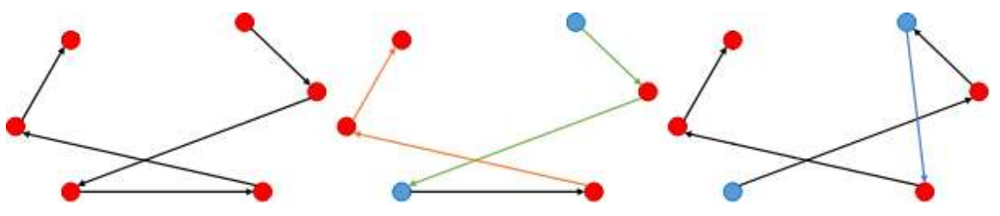

# 使用超启发式（Hyper-Heuristic） 优化带有社会距离规定的观光旅游问题（Sightseeing Tour Problem with Social Distancing Regulations）

**传统的TSP问题是指假设有一个旅行[商人](https://baike.baidu.com/item/商人/1243610)要拜访n个城市，他必须选择所要走的路径，路径的限制是每个城市只能拜访一次，而且最后要回到原来出发的城市。路径的选择目标是要求得的路径路程为所有路径之中的最小值。**

**本项目假定，指出给定N个地标和office，目标是找到一条路线可以确保从office开始和结束时，一次对所有地标的访问一次，使得总行程时间最小化。**

### 项目描述文件

### 结果表示(Representation) 每个地点使用顺序编码，每个数字代表一个地点。如[0,1,3,2,4]表示先后访问0，1，3，2，4号地点。

**目标函数(Object Function Value) 游览完所有景点并回到office的总耗时：每个地点的游玩时间+相邻两个访问地点的穿越时间+从office出发到第一个景点的时间和最后一个景点回到office的时间**

#### 计算公式


### **格式为.sdsstp 文件，存储了每个instance的内容**

### libraries-15.sdsstp 展示

```/
NAME:                    //此次浏览的名字
nottingham libraries
LANDMARKS:               //景点总数
13               
TIME_MATRIX:             //获取从第x行到y列的穿越时间 x y 属于景点编码
0 39 68 102 20 47 68 55 26 29 54 79 51
39 0 89 91 37 41 43 21 55 45 78 93 28
67 95 0 85 58 63 102 108 47 43 16 16 82
115 87 85 0 93 56 56 78 109 87 98 69 57
19 37 64 83 0 31 57 55 22 15 39 55 48
45 41 64 55 31 0 34 42 50 32 54 55 25
71 47 97 51 58 35 0 25 87 60 83 86 17
53 21 98 83 58 48 28 0 74 63 96 96 20
26 59 48 112 24 55 77 83 0 23 37 61 68
31 50 48 78 16 32 71 68 24 0 29 46 49
57 79 17 83 39 47 88 93 32 27 0 25 80
69 93 16 72 53 51 85 89 60 40 22 0 68
55 29 82 67 42 25 17 21 72 49 79 68 0
TIME_FROM_OFFICE:     //从office出发到x的时间 x属于景点编码
39 33 66 64 25 12 42 42 47 26 50 54 22
TIME_TO_OFFICE:       //从x出发到office的时间 x属于景点编码
41 30 60 72 24 11 41 38 42 25 52 51 24
VISIT_DURATION:       //x景点游玩时间 x属于0到景点总数-1
9 7 7 12 9 5 20 9 18 7 5 7 10
OFFICE_LOCATION:      //office坐标 后用于画图
-1171 52965
LANDMARK_LOCATIONS:   //第x个景点的坐标 x属于0到景点总数-1
-1173 52999
-1147 52980
-1229 52965
-1177 52903
-1180 52985
-1176 52955
-1145 52941
-1136 52963
-1196 52999
-1191 52978
-1217 52975
-1221 52953
-1153 52954
```

### 项目过程

#### 1.实现低等级的启发式算法

* **近邻交换（Adjacent Swap）随机选择其中一个景点，将景点的游览顺序与下一个将要浏览的景点交换** 

  

* **反转突变（Inversion Mutation）随机选择两个景点，将这两个景点的游览顺序交换**

  ** **

* **随即重新插入（Random re-insertion）随机选择一个景点，将该重新景点随机插入不同的顺序位置**

  


* **标准下降（Next Descent）从第一个景点开始逐个尝试与下一个交换，若目标值优化则保存**

  

* **戴维斯的登山（ Davis’s Hill Climbing）随机交换两个景点顺序，若目标值小于或等于当前值则保存，重复多次**
* **遗传算法1：循环交叉 （Cycle Crossover）**

**第一步，在某个父代上随机选择1个基因，然后找到另一个父代相应位置上的基因编号，再回到第一个父代找到同编号的基因的位置，重复先前工作，直至形成一个环，环中的所有基因的位置即为最后选中的位置：**

**第二步，用父代1中选中的基因生成子代，并保证位置对应：**

**第三步，将父代2中剩余基因放入子代中：**

* **遗传算法2：顺序交叉 （Ordered Crossover）**

#### 2.实现高层超启发式算法

**1. 随机初始化5组解，代表不同的游览路线，并计算每组解的目标函数值，记录最优解的值**

**2. 赋予每个启发式算法特定的整数值**

**3. 在一定时间内，开始重复运算： 1.找到目标函数值最高的解，找到赋值最高的启发式算法，对该解实行该启发式算法，并得到新的目标函数值**

​                               **2.如果目标函数值有所优化，则该启发式算法+1分 反之-1分，达到强化学习的目的。**

​                           **3. 新解的继承：本项目采取动态阈值继承：新的解将会继承，如果目标函数有所优化或满足新目标值 <= (1 + Delta )*最优解值**


**4, 从五组解中获取最优解，并绘图**

